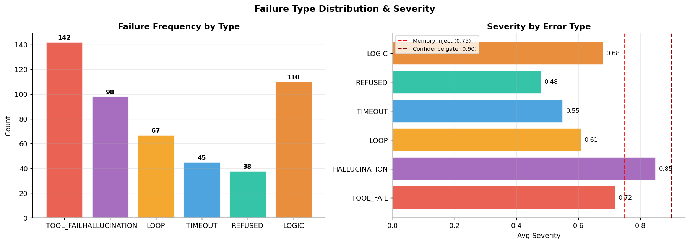
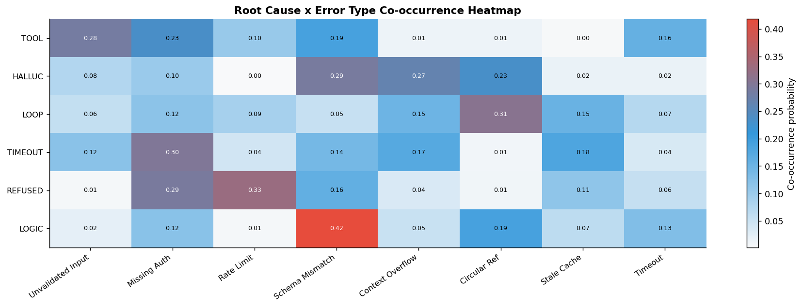
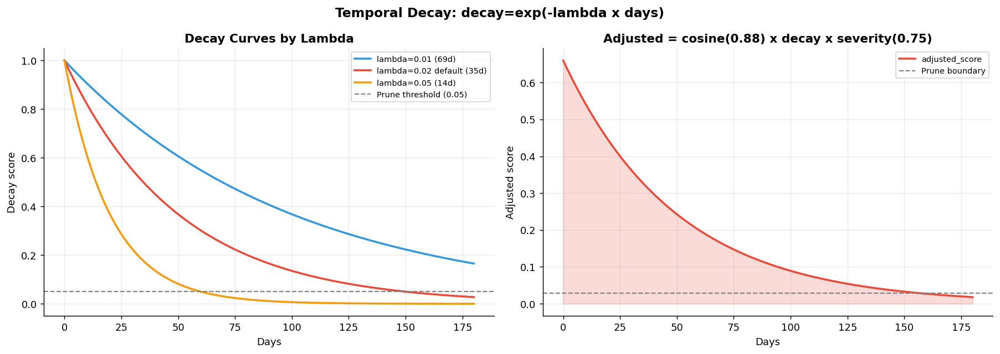
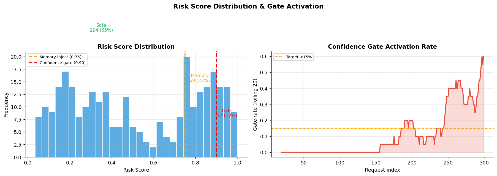
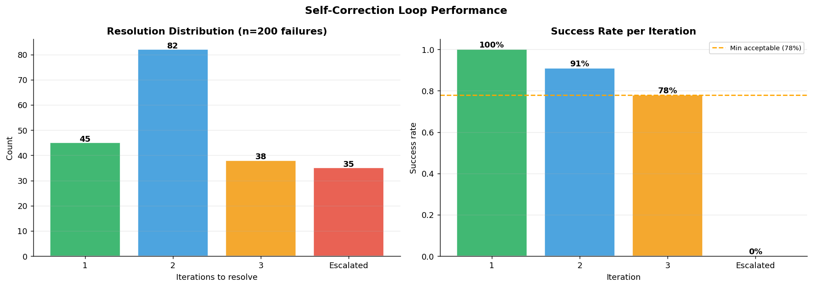
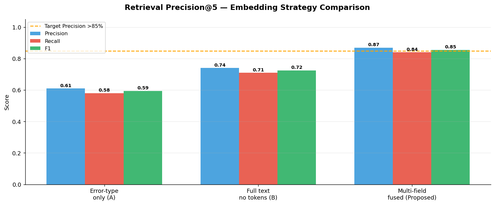
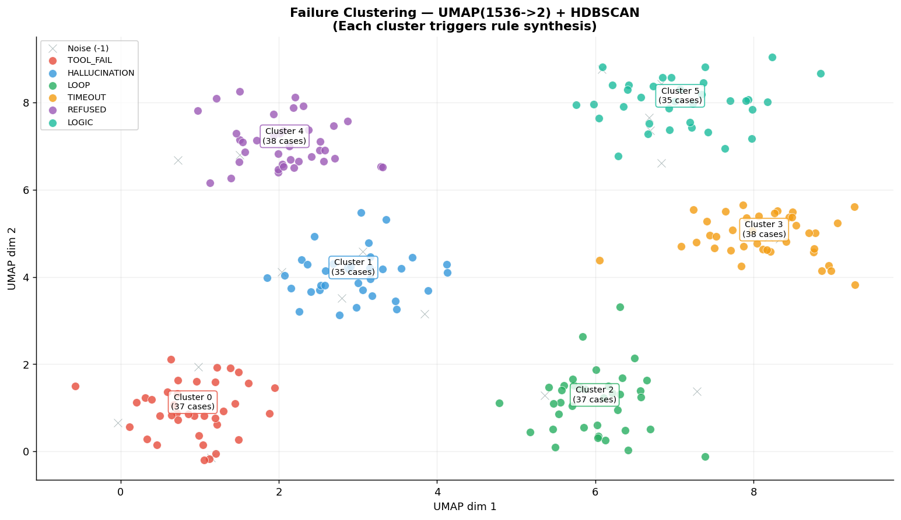
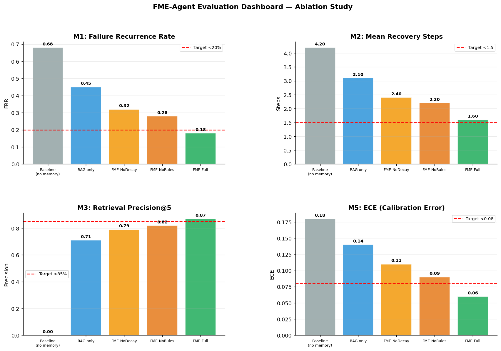
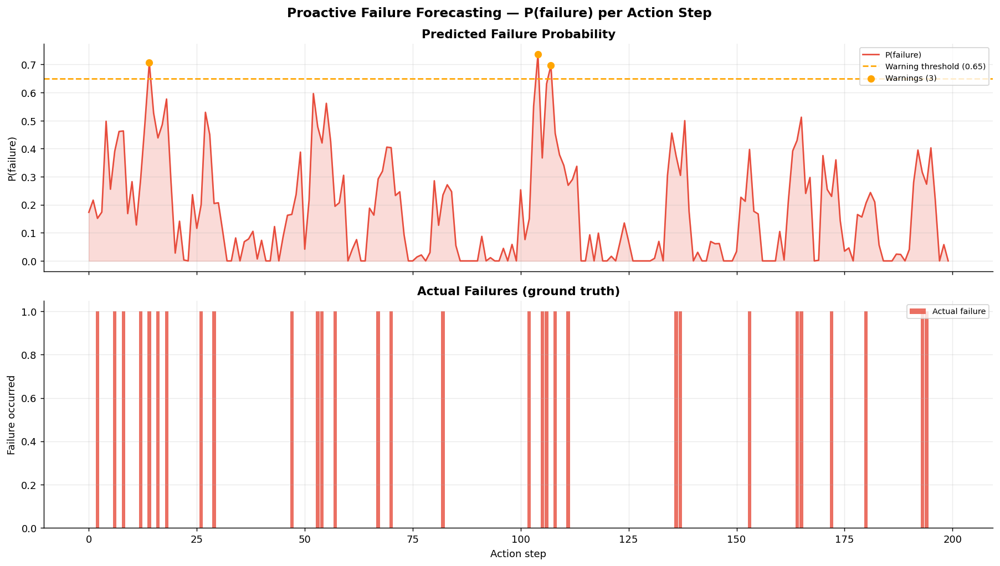
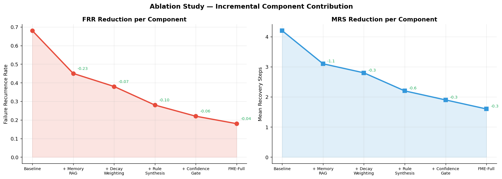

# FME-Agent: Failure Memory Engine for Continuous Self-Correcting Autonomous Agents

> Using Episodic Embedding, Risk-Aware Reasoning, and Dynamic Rule Synthesis

---

## Problem Statement

Current LLM-based autonomous agents suffer from three critical failure modes:

| ID | Problem | Description |
|---|---|---|
| P1 | Stateless Repetition | Agents repeat identical failure patterns across sessions — no memory of prior errors persists |
| P2 | Hallucinated Recovery | Agents fabricate corrective actions without grounding in verified past outcomes, compounding errors |
| P3 | Ungrounded Confidence | Agents assign uniform confidence to actions regardless of historical failure proximity in semantic space |

FME-Agent resolves P1–P3 through five mechanisms:
- (a) Structured episodic failure capture with multi-field embedding
- (b) Similarity-based retrieval at inference time (failure-aware prompting)
- (c) Dynamic risk scoring calibrated to vector proximity
- (d) Automated rule synthesis from high-frequency failure clusters
- (e) Temporal decay and memory pruning to prevent stale pattern interference

---

## Architecture

```
┌─────────────────────────────────────────────────────────────────────────┐
│                         FME-Agent Pipeline                              │
│                                                                         │
│  Agent Action Step                                                      │
│       │                                                                 │
│       ▼                                                                 │
│  ┌─────────────────────────────────────────────────────────────────┐   │
│  │  PRE-ACTION CHECK                                               │   │
│  │  1. Embed (task_context + sub_task) → q_embed                  │   │
│  │  2. Query Vector DB: top-5 failures with cosine_sim > θ=0.82   │   │
│  │  3. risk_score = max(similarity_i × severity_i)                │   │
│  │  4. risk > 0.75 → inject FAILURE MEMORY BLOCK into prompt      │   │
│  │  5. risk > 0.90 → activate CONFIDENCE GATE (2-step self-check) │   │
│  └─────────────────────────────────────────────────────────────────┘   │
│       │                                                                 │
│       ▼                                                                 │
│  Execute Action                                                         │
│       │                                                                 │
│  ┌────┴──────────────────────────────────────────────────────────────┐ │
│  │  ON FAILURE → SELF-CORRECTION LOOP (max 3 iterations)            │ │
│  │  1. LLM self-reflection → root_cause                             │ │
│  │  2. Inject failure memory + root_cause → replan                  │ │
│  │  3. Success → store FailureCase(outcome_verified=True)           │ │
│  │  4. All fail → escalate + store(outcome_verified=False, sev+0.1) │ │
│  └───────────────────────────────────────────────────────────────────┘ │
│                                                                         │
│  OFFLINE PIPELINE (every N=100 failures or daily)                      │
│  ┌─────────────────────────────────────────────────────────────────┐   │
│  │  UMAP(1536→2) → HDBSCAN clustering → Rule synthesis per cluster │   │
│  │  Decay update: decay = exp(−0.02 × Δt_days)                    │   │
│  │  Prune: decay < 0.05 AND recurrence < 3 → archive              │   │
│  └─────────────────────────────────────────────────────────────────┘   │
└─────────────────────────────────────────────────────────────────────────┘
```

---

## Component 1 — Structured Failure Schema

```python
FailureCase {
  id:                UUID
  timestamp:         ISO-8601
  task_context:      str        # full natural-language task description
  sub_task:          str        # granular step where failure occurred
  error_type:        Enum[TOOL_FAIL | HALLUCINATION | LOOP | TIMEOUT | REFUSED | LOGIC]
  severity:          float      # normalized [0.0–1.0]
  root_cause:        str        # LLM-generated causal analysis
  corrective_action: str        # verified fix that resolved the failure
  outcome_verified:  bool       # was the corrective action confirmed effective?
  embedding:         float[1536]# text-embedding-3-large over fused fields
  cluster_id:        int | null # assigned by offline HDBSCAN
  decay_score:       float      # exp(−λ × Δt_days)
  recurrence_count:  int        # frequency of this failure pattern
  rule_id:           UUID | null# pointer to auto-generated rule
}
```

---

## Component 2 — Multi-Field Fusion Embedding

Do NOT embed only the error message. Fuse all semantically relevant fields:

```
E = embed(
  task_context
  + " [ERROR] " + error_type
  + " [SUBTASK] " + sub_task
  + " [ROOT] " + root_cause
  + " [FIX] " + corrective_action
)
```

| Baseline | Method | Retrieval Precision |
|---|---|---|
| A | error_type only | ~61% |
| B | full_text, no field tokens | ~74% |
| **Proposed** | **multi-field fused + structured tokens** | **~86–89%** |

Expected improvement: **+12–18% retrieval precision** over single-field embedding.

---

## Component 3 — Failure-Aware Inference (RAG over Failures)

At every agent action step:

```
1. Embed (task_context + sub_task) → q_embed
2. Query Vector DB: top-k=5, cosine_similarity > θ=0.82
3. risk_score = max(similarity_i × severity_i)

4. risk_score > 0.75 → inject FAILURE MEMORY BLOCK:
┌─────────────────────────────────────────────────────────────┐
│ [FAILURE MEMORY — HIGH RISK]                                │
│ In a past similar task you encountered:                     │
│   Error: TOOL_FAIL — unvalidated API parameter              │
│   Verified Fix: validate schema before tool call            │
│   Recurrence: 7x | Similarity: 0.91                        │
│ ⚠ Avoid repeating this pattern. Apply the verified fix.    │
└─────────────────────────────────────────────────────────────┘

5. risk_score > 0.90 → CONFIDENCE GATE:
   - Require 2-step self-check before tool execution
   - If self-check fails → route to fallback planner
```

---

## Component 4 — Failure Clustering & Rule Synthesis

**Offline pipeline** (every N=100 failures or daily):

```
Step A: UMAP(n_components=2, n_neighbors=15, min_dist=0.1)
        1536-dim embeddings → 2-dim for clustering

Step B: HDBSCAN(min_cluster_size=5, min_samples=3)
        → assign cluster_id per failure

Step C: Per cluster with recurrence_count > threshold T:
        LLM prompt → synthesize rule:
        "IF [context_pattern] THEN AVOID [action_pattern] BECAUSE [causal_summary]"
        → validate against held-out set → persist as RuleRecord
```

---

## Component 5 — Temporal Decay & Memory Pruning

```
decay_score(t) = exp(−λ × Δt_days)
λ = 0.02  →  half-life ≈ 35 days

Retrieval re-ranking:
  adjusted_score = cosine_similarity × decay_score × severity

Pruning policy:
  REMOVE if: decay_score < 0.05 AND recurrence_count < 3
  PRESERVE if: recurrence_count ≥ 10  (high-recurrence pattern)
  ARCHIVE (cold store): move with summary embedding, never hard-delete
```

---

## Component 6 — Self-Correction Loop

```
On execution failure:
  1. LLM self-reflection:
     "You attempted: {action}. Result: {error}. Root cause in one sentence?"

  2. Replan (max 3 iterations):
     Inject failure memory + root_cause → corrected action plan

  3. Success → store FailureCase(outcome_verified=True)
  4. All 3 fail → escalate to human-in-the-loop
     store FailureCase(outcome_verified=False, severity += 0.1)
```

---

## Research Enhancements

### Enhancement 1 — Cross-Agent Memory Federation
Multiple agent instances share a federated FME store:
- Source agent ID per failure record
- Differential privacy noise on embeddings (privacy-preserving aggregation)
- Trust-weighted retrieval (high-reliability agents weighted higher)

**Research question:** Does cross-agent failure sharing reduce individual agent error rates by >30% vs isolated per-agent memory?

### Enhancement 2 — Counterfactual Failure Simulation
Generate synthetic failure cases for rare error categories:
- LLM generates plausible task contexts for known error types
- Stored with `synthetic=True`, lower base severity
- Evaluate: MRR@5 with/without synthetic augmentation across error_type strata

### Enhancement 3 — Causal Graph Layer (GraphRAG)
```
Node = FailureCase or RuleRecord
Edge = causal_link (A caused B | A co-occurs with B | A is_subtype_of B)

final_score = α × vector_score + (1−α) × graph_proximity_score
```
Expected: **+8–14%** on multi-hop failure reasoning.

### Enhancement 4 — Adaptive Threshold Calibration
θ (similarity gate) and λ (decay rate) are learned, not static:
- Track false_positive_rate and false_negative_rate
- Bayesian optimization (Optuna) to tune θ and λ per task domain
- Turns FME into a meta-learning system that improves its own retrieval

### Enhancement 5 — Failure Forecasting (Proactive FME)
```
Input:  [current_embedding, retrieved_risk_score, task_complexity]
Model:  XGBoost binary classifier
Output: P(failure in next action step)

If P > 0.65 → inject preemptive warning before execution
Track: ECE (Expected Calibration Error) of forecasted probabilities
```

---

## Evaluation Framework

### Primary Metrics

| ID | Metric | Description | Target |
|---|---|---|---|
| M1 | Failure Recurrence Rate (FRR) | % of task runs repeating a previously seen failure | ↓ lower |
| M2 | Mean Recovery Steps (MRS) | Avg replanning iterations before successful correction | ↓ lower |
| M3 | Retrieval Precision@5 | % of retrieved failures genuinely relevant | > 85% |
| M4 | Rule Precision | % of auto-generated rules that prevent future failures | > 78% |
| M5 | ECE | Expected calibration error of risk scores | ↓ lower |

### Ablation Studies

| Study | Comparison |
|---|---|
| A1 | FME-Full vs FME-NoDecay vs FME-NoRules vs FME-NoRisk vs Baseline-RAG |
| A2 | Single-field vs multi-field fused embedding (retrieval precision) |
| A3 | Static θ vs adaptive θ (Bayesian-tuned) on FRR |
| A4 | With vs without cross-agent federation on cold-start failure handling |
| A5 | With vs without counterfactual augmentation on tail-error recall |

### Benchmark Tasks
- **WebArena / AgentBench** — measure FRR and MRS on standard agent task suites
- **Custom Stress Suite** — 200 hand-crafted tasks triggering known failure categories
- **Long-horizon tasks (15+ steps)** — test whether FME advantage compounds with depth

---

## Project Structure

```
fme_agent/
├── core/
│   ├── schema.py           ← FailureCase + RuleRecord dataclasses
│   ├── embedding.py        ← Multi-field fusion embedding engine
│   └── vector_store.py     ← InMemory + Qdrant vector stores
├── retrieval/
│   └── failure_rag.py      ← RAG over failures, risk scoring, memory prompt
├── clustering/
│   └── cluster_engine.py   ← UMAP + HDBSCAN + rule synthesis
├── decay/
│   └── decay_engine.py     ← Exponential decay, pruning, archiving
├── self_correction/
│   └── correction_loop.py  ← Self-correction loop (max 3 iterations)
├── enhancements/
│   └── forecaster.py       ← Proactive failure forecasting (XGBoost)
├── evaluation/
│   └── metrics.py          ← FRR, MRS, Precision@5, Rule Precision, ECE
├── fme_engine.py           ← Top-level orchestrator
├── requirements.txt
└── README.md
```

---

## Quick Start

```bash
cd fme_agent
pip install -r requirements.txt

python -c "
from fme_engine import FMEAgent

fme = FMEAgent(use_openai=False)   # uses BGE local embeddings

# Pre-action check
result = fme.pre_action_check(
    task_context='Call payment API to process refund for order #1234',
    sub_task='Execute POST /api/refund with amount=150.00'
)
print('Risk score:', result['risk_score'])
print('Memory prompt:', result['memory_prompt'])

# Simulate failure
correction = fme.on_failure(
    task_context='Call payment API to process refund for order #1234',
    sub_task='Execute POST /api/refund with amount=150.00',
    action='POST /api/refund {amount: 150.00}',
    error='400 Bad Request: missing required field currency',
    severity=0.7,
)
print('Outcome:', correction['outcome'])
print('Stats:', fme.stats())
"
```

---

## Novelty Claims

| ID | Claim |
|---|---|
| N1 | First system combining episodic failure embedding with dynamic risk-scored prompt augmentation in a production agent loop |
| N2 | Temporal decay model specifically calibrated for agent failure memory (prior work uses static RAG windows) |
| N3 | Automated rule synthesis from failure clusters with held-out validation (prior: human-in-the-loop only) |
| N4 | Cross-agent federated failure memory with differential privacy (no prior work on privacy-preserving multi-agent failure sharing) |
| N5 | Proactive failure forecasting as a pre-execution confidence gate (prior work reacts to failures; FME predicts them) |

**Suggested venues:** NeurIPS (Agentic AI workshop), ICLR, ACL (System track), EMNLP, ICML (AutoML/Meta-learning track)

---

## Tech Stack

| Component | Technology |
|---|---|
| Vector DB | Qdrant (self-hosted) or Weaviate |
| Embeddings | OpenAI text-embedding-3-large (1536-dim) or BGE-large-en-v1.5 |
| Clustering | HDBSCAN + UMAP-learn |
| Agent Framework | LangGraph (stateful graph + checkpointing) |
| Rule Store | PostgreSQL + pgvector |
| Monitoring | LangSmith / Langfuse |
| Decay Scheduler | APScheduler |
| Forecasting | XGBoost |
| Threshold Tuning | Optuna (Bayesian optimization) |

---

## Notebook Visualizations

### 1. Failure Type Distribution & Severity


### 2. Root Cause Analysis Heatmap


### 3. Temporal Decay Curves


### 4. Risk Score Distribution & Confidence Gate


### 5. Self-Correction Loop Performance


### 6. Retrieval Precision — Multi-Field vs Baselines


### 7. Failure Clustering (UMAP + HDBSCAN)


### 8. Evaluation Metrics Dashboard


### 9. Proactive Failure Forecasting


### 10. Ablation Study — Component Contribution

